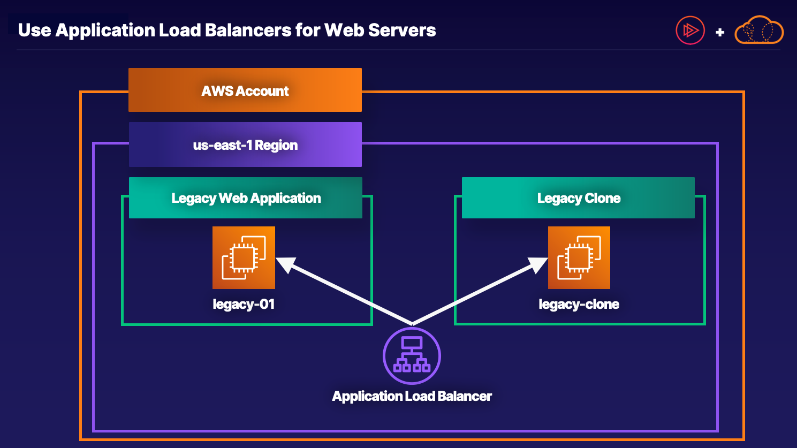

# aws-legacy-application-load-balancer



This repository contains Terraform code to deploy a simple AWS infrastructure consisting of EC2 instances, an Application Load Balancer (ALB), and associated security groups. These resources are set up in a specified VPC with public subnets and allow SSH and HTTP traffic.

## Prerequisites

Before you begin, ensure you have the following:

- [Terraform](https://www.terraform.io/downloads.html) installed on your local machine.
- AWS credentials configured on your machine with appropriate permissions to create and manage EC2 instances, ALB, security groups, and VPC resources.

## Usage

1. **Clone this repository to your local machine:**

   ```bash
   git clone <repository-url>
   cd <repository-directory>

2. **Modify the variables:**

Open the variables.tf file and adjust the variables to match your requirements. You can change the AWS region, VPC ID, key pair name, instance count, AMI ID, instance type, and other settings.

2. **Initialize Terraform:**


 ```bash
terraform init
 ```
3. **Terraform Plan:**
 ```bash
terraform plan
 ```

4. **Apply the changes:**

 ```bash
terraform apply
 ```

Confirm by typing yes when prompted.

## Access your infrastructure:

After the deployment is complete, Terraform will output the DNS name of the ALB. You can access your web servers via this ALB DNS name.


5**To destroy the infrastructure and clean up all AWS resources created by Terraform, run:**


 ```bash
terraform destroy
 ```


## Variables

* `aws_region`: The AWS region where resources will be created (default: us-east-1).
* `subnet_ids:`:List of subnet IDs for the ALB.
* `vpc_id`: The ID of the VAC where resources will be created.
* `key_pair_name`: The name of the key pair for EC2 instances.
* `instance_count`: Number of EC2 instances to create.
* `ami_id`: The ID of the AMI to use for EC2 instances.
* `instance_type`: The EC2 instance type for the instances.
* `stickiness_duration`: The duration of stickiness in seconds (default: 86400, which is 1 day).
* `igw_id`: The ID of the internet gateway.
